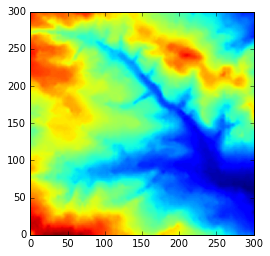
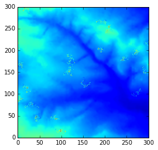

|[Home](index.md)    | [About Jen](AboutJen.md) |   [PhD](PhD.md)  | [MSc](MSc.md)    | [Projects](Projects.md)  | 

# MSc

The Integrated PhD programme includes an MSc Data Analytics and Society, in which there are core modules including:
- Researching Society and Culture
- Programming for Social Science: Core Skills
- Understanding Data and their Environment
- Analysis of Human Dynamics
- Social Analytics and Visualisation

### Programming for Social Science

Programming for Social Science was the first module of the MSc, conducted as an intense, week long module in which we, with the guidance of [Andy Evans](https://www.geog.leeds.ac.uk/people/a.evans), developed an agent-based model.
The ABM consisted of agents (sheep), each interacting with each other and their environment (a 300x300 grid). Interactions included movements, grazing the environment, sharing their store (eaten food) with other sheep within their neighbourhood, and also being sick if they were too greedy!

Below are two outputs created to show the impact that the sheep have upon the environment within the ABM, the third shows the environment with the sheep's end locations. 

| | | |
|---|---|---|
|*Environment before sheep interaction* |   *Environment after sheep interaction* | *Environment interaction with sheep* |

The first assignment for this modules therefore includes an [online portfolio](https://github.com/jgray1923/Portfolio) of the ABM, a snippet of code can be seen below. 

```Python
num_of_agents = 15
num_of_iterations = 100
neighbourhood = 35

# Create a list for agents
agents =[]

# Create for loop for creating random starting coordinates for agents, within 
# the given environment
for i in range(num_of_agents):
    agents.append(agentframework.Agent(environment, agents))

# Due to the for loop and agent framework, we can now refer to each agent as agents[i]
# Due to the Agent class, we can refer to the x coordinate as agents[i].x
# and we can refer to the y coordinate as agents[i].y

# Create for loop for the movement of agents (sheep), and their subsequent 
# eating/grazing throughout the environment. If the sheep are within close proximity
# to one another (neighbourhood), the sheep will share their store!
for j in range(num_of_iterations):
# Ramdomise the agent's iterations    
    random.shuffle(agents)
    for i in range(num_of_agents):
        agents[i].move()
        agents[i].eat()
        agents[i].sick()
        agents[i].share_with_neighbours(neighbourhood)
        agents[i].consumption()
 ```

 Assignment 1 also included the creation of a series of web pages. These GitHub Pages were written in Markdown, but [these](https://github.com/jgray1923/WEBPRACTICEjgray1923.github.io)
were written in and display my (fairly limited!) knowledge of HTML. 
